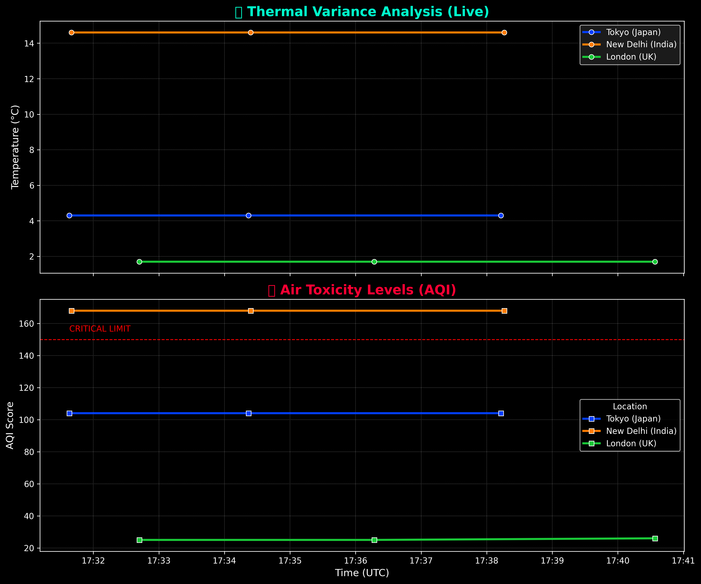

# 🌍 Sentinel: Environmental Health Bio-Surveillance System

<div align="center">


**A Full-Stack Data Intelligence Platform** that aggregates real-time satellite telemetry to detect environmental health threats (Hyperthermia, AQI Toxicity) across 50+ global metropolitan hubs.

[View Demo](#-visual-intelligence) • [Installation](#-quick-start-guide) • [Architecture](#%EF%B8%8F-system-architecture)

</div>

---

## 📖 Executive Summary
According to the WHO, environmental factors are responsible for **24% of the global burden of disease**. Standard weather tools fail to correlate raw metrics with human physiological limits.

**Sentinel** is an automated **Bio-Surveillance Engine** designed to bridge this gap. It acts as a "Planetary Black Box," ingesting satellite data every 60 seconds to calculate medical risk metrics—specifically **Wet Bulb Temperature ($T_w$)** and **PM2.5 Toxicity**—to identify zones where the environment poses an immediate threat to human survival.

---

## 🏗️ System Architecture

The project utilizes a **Decoupled ETL (Extract, Transform, Load)** architecture to ensure scalability, fault tolerance, and data persistence.

```mermaid
graph TD
    subgraph Ingestion Layer [📡 Data Collection]
        A[Open-Meteo Satellite API] -->|JSON Stream| B(climate_data_pipeline.py)
        D[world_cities.csv] -->|Dynamic Config| B
    end
    
    subgraph Storage Layer [💾 Data Warehousing]
        B -->|Append Time-Series| C[(climate_history.csv)]
    end
    
    subgraph Intelligence Layer [🧠 Analytics & Viz]
        C -->|Read History| E(trend_visualizer.py)
        E -->|Matplotlib Engine| F[Analytics Report (PNG)]
        D -->|Read Config| G(climate_map.py)
        A -->|Real-time Feed| G
        G -->|Folium Engine| H[Interactive Dashboard (HTML)]
    end
```

### 🔬 Scientific Methodology

Sentinel evaluates risk using epidemiological algorithms rather than raw weather data.

#### 1. The Hyperthermia Proxy: Wet Bulb Temperature ($T_w$)
We utilize the **Stull (2011) Formula** to estimate $T_w$. This metric represents the lowest temperature a body can achieve via evaporative cooling (sweating).

$$
T_w = T \cdot \arctan[0.151977 \cdot (RH + 8.313659)^{1/2}] + \dots
$$

* **Clinical Threshold:** When $T_w > 32^\circ C$, the human body loses the ability to cool itself, leading to rapid heatstroke and organ failure.

#### 2. Respiratory Toxicity: Air Quality Index (AQI)
The system categorizes respiratory risk based on US EPA standards for Particulate Matter (PM2.5).

| AQI Value | Risk Level | Clinical Implication |
| :--- | :--- | :--- |
| **0 - 50** | 🟢 Good | No risk. |
| **51 - 100** | 🟡 Moderate | Risk to extremely sensitive individuals. |
| **101 - 150** | 🟠 Unhealthy | Asthma/COPD exacerbation likely. |
| **150+** | 🔴 Hazardous | General population risk; cardiovascular strain. |

---

## 🚀 Key Modules

### ⚙️ 1. The Data Pipeline (`climate_data_pipeline.py`)
* **Role:** Automated ETL Engine.
* **Function:** Polls satellite APIs every 60 seconds for strategic locations defined in `world_cities.csv`.
* **Engineering:** Implements rate-limiting to prevent API bans and auto-recovers from network failures.
* **Output:** Generates a persistent time-series dataset (`climate_history.csv`).

### 🗺️ 2. The Geospatial Engine (`climate_map.py`)
* **Role:** Visualization Interface.
* **Function:** Generates an interactive HTML heatmap (`global_climate_dashboard.html`) utilizing `folium`.
* **Logic:**
    * **Safe Zones (Green):** Normal environmental parameters.
    * **Crisis Zones (Red):** Areas where environmental stress compounds with humanitarian crises (e.g., Sudan, Syria).
    * **Heatmap Layer:** Visualizes thermal intensity gradients globally.

### 📈 3. The Analytic Engine (`trend_visualizer.py`)
* **Role:** Business Intelligence (BI).
* **Function:** Parses the historical CSV database to generate "Dark Mode" executive reports using `pandas` and `seaborn`.
* **Insight:** Compares Temperature vs. AQI trends over time to detect correlation patterns between urban heat islands and pollution.

---

## 📊 Visual Intelligence

| **The Interactive Map** | **The Analytics Report** |
| :---: | :---: |
| *Real-time geospatial risk assessment* | *Longitudinal trend analysis* |
|  |  |

*(Note: Run the scripts locally to generate the latest visualizations)*

---

## 🛠️ Quick Start Guide

### Prerequisites
* Python 3.8+
* `pip` package manager

### Installation
1.  **Clone the Repository**
    ```bash
    git clone https://github.com/PradyumnShirsath/environmental-health-risk-monitor.git
    cd environmental-health-risk-monitor
    ```

2.  **Install Dependencies**
    ```bash
    pip install -r requirements.txt
    ```

### Execution
1.  **Start the Data Engine** (Let this run in the background to collect data)
    ```bash
    python climate_data_pipeline.py
    ```
    > *Output: `climate_history.csv` will be created and populated.*

2.  **Generate the Visuals** (Open a new terminal)
    ```bash
    python climate_map.py       # Generates global_climate_dashboard.html
    python trend_visualizer.py  # Generates climate_trends_report.png
    ```

---

##  Future Roadmap
* [ ] **Machine Learning:** Integrate LSTM neural networks to *forecast* AQI spikes 24h in advance.
* [ ] **SMS Alerts:** Integration with Twilio API to send real-time health warnings to field agents.
* [ ] **Cloud Deployment:** Containerize the pipeline using Docker for AWS/Azure deployment.

---
*Author: Pradyumn Shirsath | Developed for Research in Computational Sustainability & Public Health*
